# 👗 FashionRenewal

> **Your Wardrobe, Reimagined** - A sustainable peer-to-peer marketplace for renting, selling, and swapping high-end fashion.

[](https://fashion-renewal.vercel.app/)
[](https://fashionrenewal.up.railway.app/)
[](LICENSE)
[](https://www.typescriptlang.org/)

---

## 🌟 Overview

**FashionRenewal** is a production-ready, full-stack monorepo application designed to circularize the fashion economy. By enabling users to seamlessly rent, sell, and swap clothing, we reduce textile waste while democratizing access to luxury items.

Built with **performance**, **scalability**, and **type safety** at its core, utilizing a modern stack of React 18, NestJS, and PostgreSQL.

### 🚀 Quick Links
- **Frontend App**: [https://fashion-renewal.vercel.app](https://fashion-renewal.vercel.app)
- **Backend API**: [https://fashionrenewal.up.railway.app](https://fashionrenewal.up.railway.app)

---

## 🏗️ System Architecture

The application follows a robust **Client-Server architecture** with a clear separation of concerns.

```mermaid
graph TD
    User[👤 User] -->|HTTPS| CDN[⚡ Vercel Edge Network]
    CDN -->|Serve Static| Client[⚛️ React SPA]
    
    Client -->|REST API| LB[🛡️ Railway Load Balancer]
    LB -->|Request| API[🦅 NestJS Server]
    
    subgraph Backend Services
        API -->|ORM| DB[(🐘 PostgreSQL)]
        API -->|Auth| Jwt[🔐 JWT Service]
        API -->|Uploads| Cloud[☁️ Cloudinary]
    end
    
    subgraph "External Integrations"
        API -.->|Verification| SMS[📱 SMS Provider]
    end
```



### 🔁 Core Data Flow (Rental Request)


---

## ✨ Features & Technical Highlights

### 🛍️ **Advanced Marketplace Engine**
- **Multi-Model Commerce**: Supports **Rent** (Calendar-based), **Sell** (One-time), and **Swap** (Credit-based) in a single unified platform.
- **Optimistic Concurrency Control**: Uses versioning to handle simultaneous booking requests for high-demand items.
- **Sophisticated Filtering**: Dynamic filtering by price, brand, size, and category with server-side pagination.

### 🔐 **Trust & Security**
- **RBAC Authentication**: Role-Based Access Control (User, Validator, Admin) using JWT and Passport strategies.
- **Trusted Lender System**: Algorithmic "Trust Score" based on successful transaction history, responsiveness, and account age.
- **Verification Pipeline**: Multi-step identity verification including email and phone validation.

### 📸 **Optimized Media Pipeline**
- **Smart Uploads**: Direct-to-Cloudinary uploading with on-the-fly transformations and format optimization (f_auto, q_auto).
- **Validation Gates**: Minimum 4-image requirement for listings ensuring quality checks before database insertion.

### 🧠 **Intelligent Recommendations**
- **Behavioral Tracking**: Implicit feedback loop tracking View, Click, and Cart events.
- **Hybrid Filtering**: Combines "Recently Viewed" (Content-based) and "Trending" (Popularity-based) algorithms.

---

## 💻 Technlogy Stack

### **Frontend (Client)**
| Tech | Purpose |
|------|---------|
| **React 18** | UI Library |
| **Vite** | Next-gen Build Tool |
| **TypeScript** | Type Safety |
| **Tailwind CSS** | Utility-first Styling |
| **shadcn/ui** | Accessible Component Primitives |
| **Zustand** | Lightweight State Management |
| **React Query** | Server State & Caching |
| **Zod** | Schema Validation |

### **Backend (Server)**
| Tech | Purpose |
|------|---------|
| **NestJS** | Scalable Node.js Framework |
| **PostgreSQL** | Relational Database |
| **Prisma ORM** | Type-safe Database Access |
| **Passport** | Authentication Strategy |
| **Helmet** | HTTP Header Security |
| **Class-Validator** | DTO Validation |

---

## 🛠️ Local Development Setup

Follow these steps to get the project running on your local machine.

### **Prerequisites**
- Node.js (v18+)
- npm or pnpm
- PostgreSQL (Local or Docker container)

### **1. Clone & Install**
```bash
git clone https://github.com/janviii09/FashionRenewal.git
cd FashionRenewal
```

### **2. Database Setup**
```bash
# Navigate to backend
cd backend

# Create .env file
cp .env.example .env

# Generate Prisma Client
npx prisma generate

# Run Migrations
npx prisma migrate dev
```

### **3. Start Backend**
```bash
# In /backend terminal
npm run start:dev
# > Server running on http://localhost:3000
```

### **4. Start Frontend**
```bash
# In /frontend terminal
cd frontend
cp .env.example .env.local
npm run dev
# > App running on http://localhost:5173 (or similar)
```

---

## 🧪 Testing Strategy

We maintain rigorous code quality through a multi-layered testing strategy.

```bash
# Unit Tests
npm run test

# End-to-End Tests
npm run test:e2e
```

**Key Testing Areas:**
- **DTO Validation**: Ensuring payloads meet strict schema requirements.
- **Auth Guards**: Verifying route protection and role access.
- **Services**: Business logic verification (e.g. Price calculation, Trust Score).

---

## 🚀 Deployment

### Database (PostgreSQL)
Hosted on **Railway** for persistent storage and automatic backups.

### Backend (Railway)
- Uses **Nixpacks** for reproducible builds.
- Auto-deploys from `main` branch.
- Environment variables managed securely via Railway Dashboard.

### Frontend (Vercel)
- **Global Edge Network** for low-latency delivery.
- Automatic cache invalidation on new deployments.
- Build command: `npm run build`
- Output directory: `dist`

---

## 🤝 Contributing

We welcome contributions! Please follow our [Contribution Guidelines](CONTRIBUTING.md).

1. Fork the Project
2. Create your Feature Branch (`git checkout -b feature/AmazingFeature`)
3. Commit your Changes (`git commit -m 'feat: Add some AmazingFeature'`)
4. Push to the Branch (`git push origin feature/AmazingFeature`)
5. Open a Pull Request

---

## 📜 License

Distributed under the MIT License. See `LICENSE` for more information.

---

<p align="center">
  <small>Built with ❤️ by Janvi Gupta</small>
</p>
